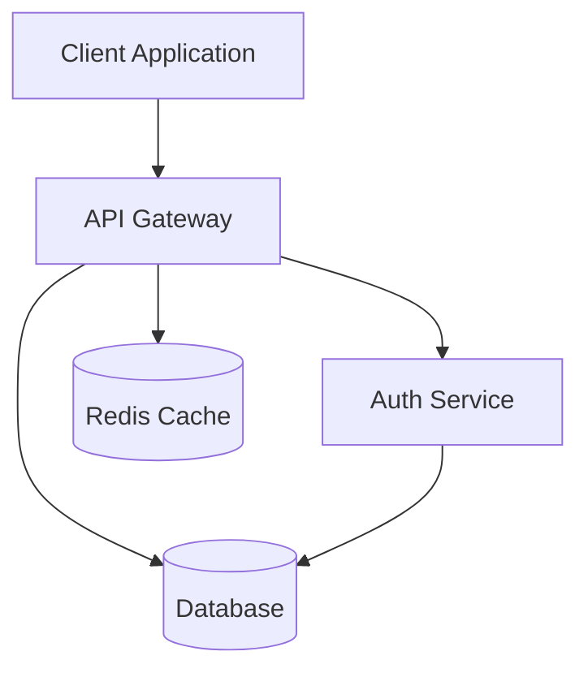
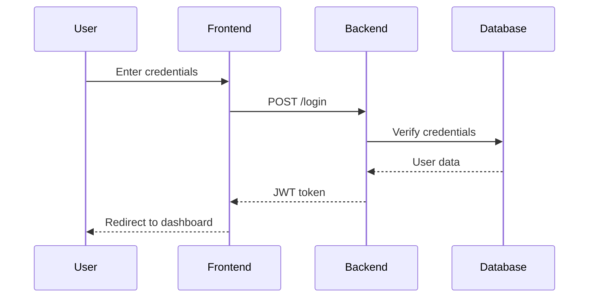
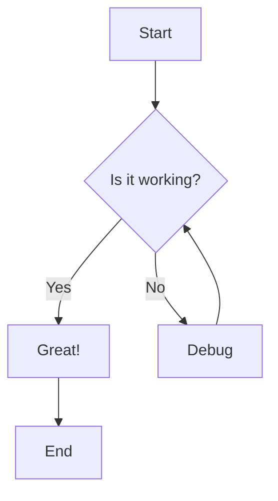
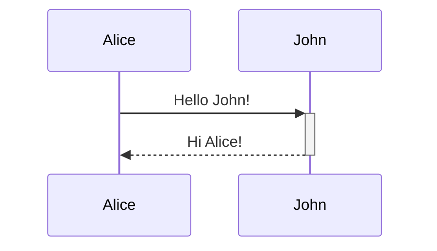
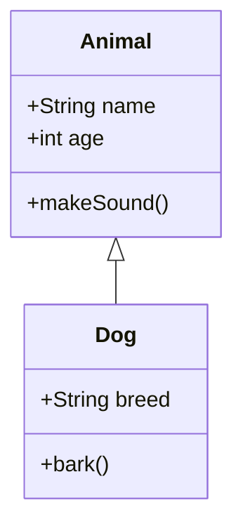
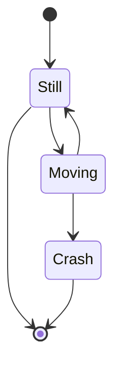
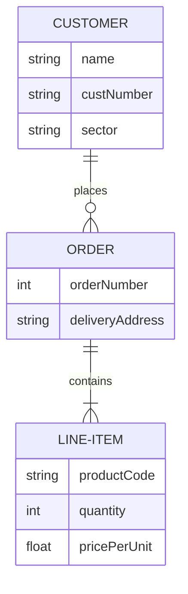
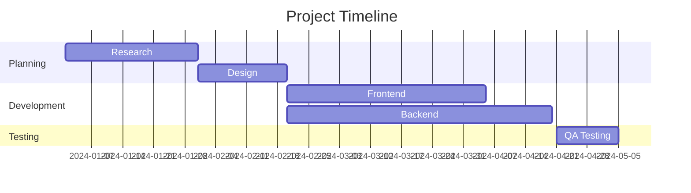
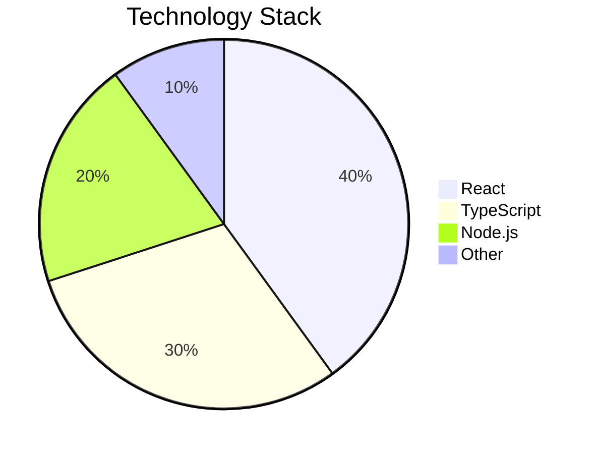

# Example Usage

This file demonstrates how to integrate fumadocs-mermaid into your Fumadocs project.

## Step 1: Install Dependencies

```bash
pnpm add fumadocs-mermaid mermaid next-themes
```

## Step 2: Configure Source (Fumadocs MDX)

```ts
// source.config.ts
import { remarkMdxMermaid } from 'fumadocs-mermaid';
import { defineConfig } from 'fumadocs-mdx/config';

export default defineConfig({
  mdxOptions: {
    remarkPlugins: [remarkMdxMermaid],
  },
});
```

## Step 3: Register MDX Component

```tsx
// mdx-components.tsx
import defaultMdxComponents from 'fumadocs-ui/mdx';
import { Mermaid } from 'fumadocs-mermaid/ui';
import type { MDXComponents } from 'mdx/types';

export function getMDXComponents(components?: MDXComponents): MDXComponents {
  return {
    ...defaultMdxComponents,
    Mermaid,
    ...components,
  };
}
```

## Step 4: Use in Your MDX Files

### Using Code Blocks (Recommended)

````mdx
---
title: My Documentation Page
---

# Architecture Overview

Here's our system architecture:



## User Flow


````

### Using Component Directly

```mdx
---
title: Custom Diagram
---

<Mermaid
  chart="
graph LR
    A[Square Rect] -- Link text --> B((Circle))
    A --> C(Round Rect)
    B --> D{Rhombus}
    C --> D
"
  theme="dark"
/>
```

## Advanced: Different Frameworks

### Next.js (App Router)

```tsx
// app/docs/[[...slug]]/page.tsx
import { source } from '@/lib/source';
import { DocsPage, DocsBody } from 'fumadocs-ui/page';
import { notFound } from 'next/navigation';

export default async function Page({ params }: { params: { slug?: string[] } }) {
  const page = source.getPage(params.slug);
  if (!page) notFound();

  const MDX = page.data.body;

  return (
    <DocsPage toc={page.data.toc}>
      <DocsBody>
        <MDX />
      </DocsBody>
    </DocsPage>
  );
}
```

### Vite

```ts
// vite.config.ts
import { defineConfig } from 'vite';
import { fumadocsVitePlugin } from 'fumadocs-mdx/vite';
import { remarkMdxMermaid } from 'fumadocs-mermaid';

export default defineConfig({
  plugins: [
    fumadocsVitePlugin({
      mdxOptions: {
        remarkPlugins: [remarkMdxMermaid],
      },
    }),
  ],
});
```

## Mermaid Diagram Types

### Flowchart



### Sequence Diagram



### Class Diagram



### State Diagram



### Entity Relationship Diagram



### Gantt Chart



### Pie Chart


