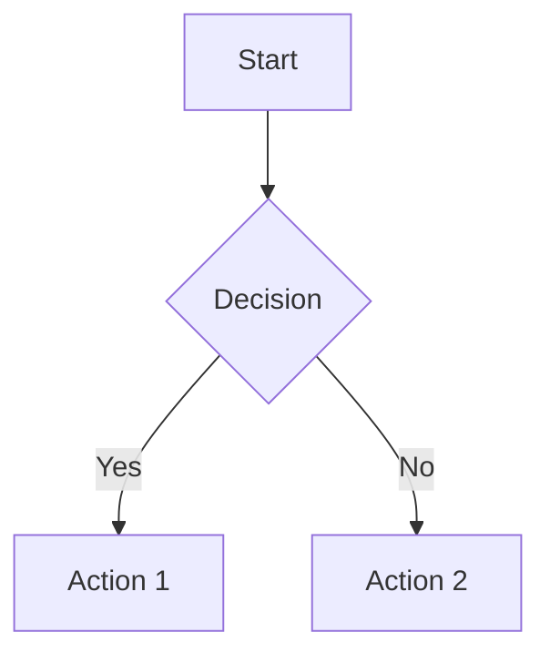
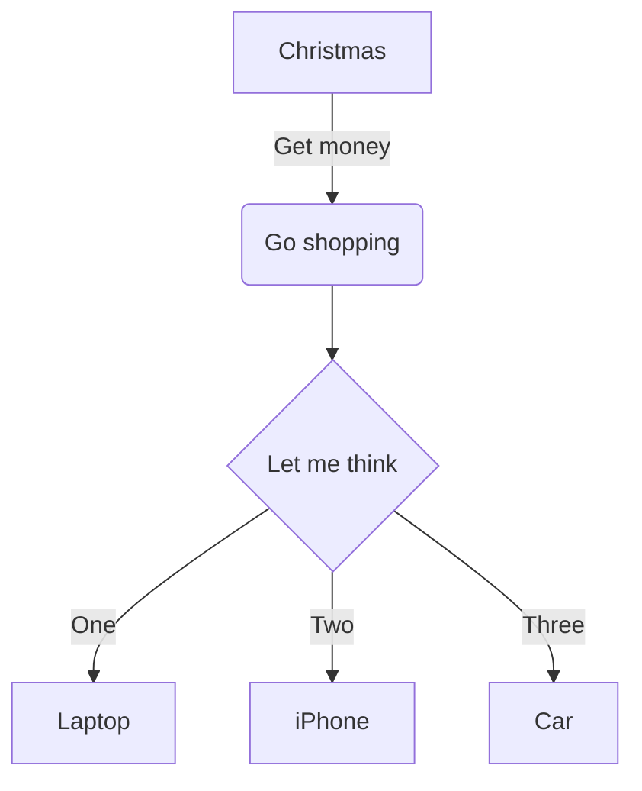
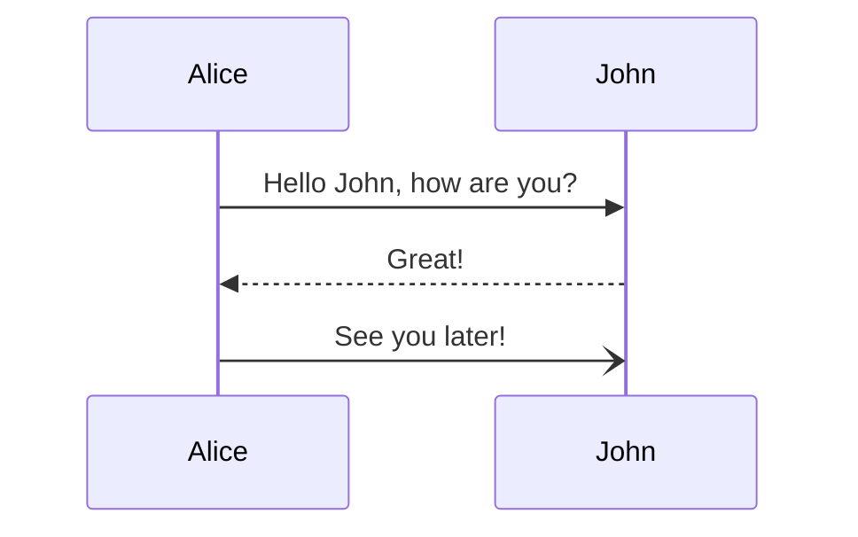
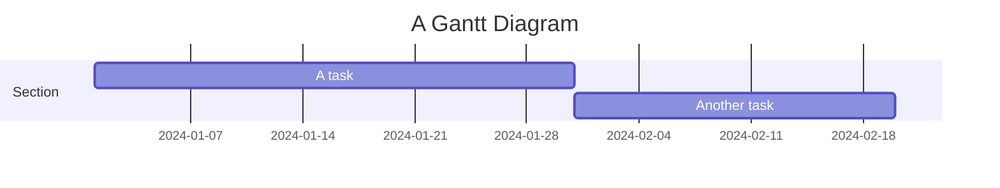
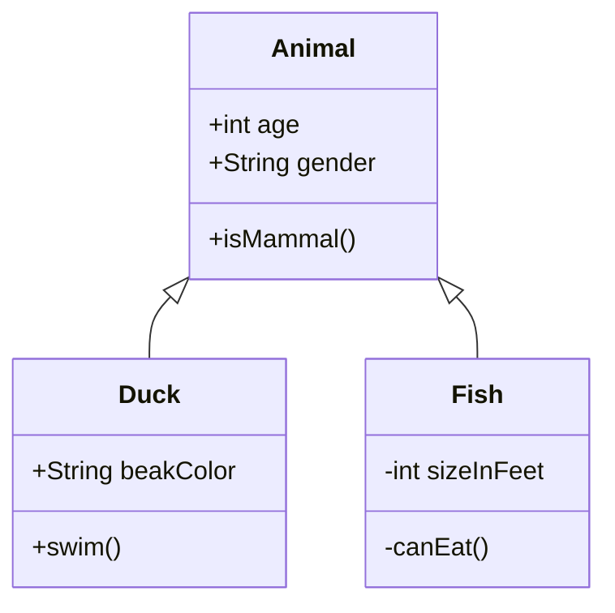

# fumadocs-mermaid

Mermaid diagram integration for [Fumadocs](https://fumadocs.dev) - a modern documentation framework for React.

## Features

- 🎨 Automatic dark/light theme support with `next-themes`
- ⚡ Client-side rendering with smart caching
- 🔌 Plug-and-play integration with Fumadocs
- 📝 Convert markdown code blocks to diagrams automatically
- 🌳 Tree-shakeable ESM package
- 💪 Full TypeScript support

## Installation

```bash
npm install fumadocs-mermaid mermaid next-themes
```

```bash
pnpm add fumadocs-mermaid mermaid next-themes
```

```bash
yarn add fumadocs-mermaid mermaid next-themes
```

## Usage

### Option 1: Direct Component Usage

Import and register the `Mermaid` component in your MDX components:

```tsx
// mdx-components.tsx
import defaultMdxComponents from 'fumadocs-ui/mdx';
import { Mermaid } from 'fumadocs-mermaid/ui';
import type { MDXComponents } from 'mdx/types';

export function getMDXComponents(components?: MDXComponents): MDXComponents {
  return {
    ...defaultMdxComponents,
    Mermaid,
    ...components,
  };
}
```

Then use it in your MDX files:

```mdx
<Mermaid
  chart="
graph TD;
  A[Start] --> B{Decision};
  B -->|Yes| C[Action 1];
  B -->|No| D[Action 2];
  C --> E[End];
  D --> E;
"
/>
```

### Option 2: Automatic Code Block Conversion (Recommended)

Use the remark plugin to automatically convert mermaid code blocks:

```ts
// source.config.ts (Fumadocs MDX)
import { remarkMdxMermaid } from 'fumadocs-mermaid';
import { defineConfig } from 'fumadocs-mdx/config';

export default defineConfig({
  mdxOptions: {
    remarkPlugins: [remarkMdxMermaid],
  },
});
```

Don't forget to register the component:

```tsx
// mdx-components.tsx
import defaultMdxComponents from 'fumadocs-ui/mdx';
import { Mermaid } from 'fumadocs-mermaid/ui';

export function getMDXComponents(components) {
  return {
    ...defaultMdxComponents,
    Mermaid,
    ...components,
  };
}
```

Now you can write mermaid diagrams using code blocks in your MDX:

````mdx

````

## API Reference

### `<Mermaid />`

The React component for rendering Mermaid diagrams.

**Props:**

| Prop | Type | Default | Description |
|------|------|---------|-------------|
| `chart` | `string` | **Required** | The mermaid diagram definition |
| `theme` | `'default' \| 'dark' \| 'neutral' \| 'forest'` | Auto-detected | Theme override. Automatically uses next-themes if available |
| `themeCSS` | `string` | `'margin: 1.5rem auto 0;'` | Additional CSS for the diagram container |

**Example:**

```tsx
<Mermaid
  chart="graph LR; A-->B;"
  theme="dark"
  themeCSS="margin: 2rem auto;"
/>
```

### `remarkMdxMermaid()`

Remark plugin to convert mermaid code blocks into `<Mermaid />` components.

**Options:**

```ts
interface RemarkMdxMermaidOptions {
  /**
   * The language identifier for mermaid code blocks
   * @defaultValue 'mermaid'
   */
  lang?: string;
}
```

**Example with custom language:**

```ts
import { remarkMdxMermaid } from 'fumadocs-mermaid';

export default defineConfig({
  mdxOptions: {
    remarkPlugins: [[remarkMdxMermaid, { lang: 'diagram' }]],
  },
});
```

## Examples

### Flowchart

````mdx

````

### Sequence Diagram

````mdx

````

### Gantt Chart

````mdx

````

### Class Diagram

````mdx

````

## Theme Support

The component automatically detects your theme using `next-themes`:

- Light mode → Uses Mermaid's `default` theme
- Dark mode → Uses Mermaid's `dark` theme

You can override this behavior with the `theme` prop:

```tsx
<Mermaid chart="graph LR; A-->B;" theme="forest" />
```

## TypeScript

The package is fully typed. Import types as needed:

```ts
import type { MermaidProps, RemarkMdxMermaidOptions } from 'fumadocs-mermaid';
```

## How It Works

1. **Client-side rendering**: Diagrams are rendered on the client to avoid hydration issues
2. **Smart caching**: Both the Mermaid library and rendered diagrams are cached for performance
3. **Theme integration**: Automatically re-renders when theme changes (when using next-themes)
4. **Remark plugin**: Transforms markdown code blocks at build time into React components

## Requirements

- React 18+ or 19+
- Mermaid 10+ or 11+
- next-themes (optional, for automatic theme detection)

## License

MIT

## Credits

Inspired by the Mermaid integration examples from the official [Fumadocs documentation](https://fumadocs.dev/docs/markdown/mermaid).
