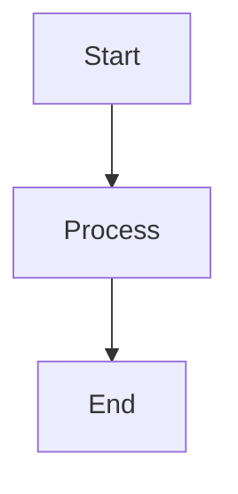
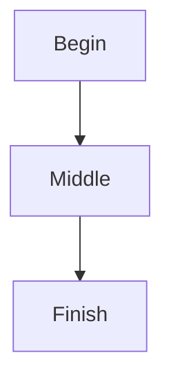
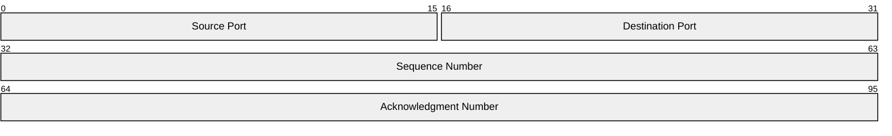
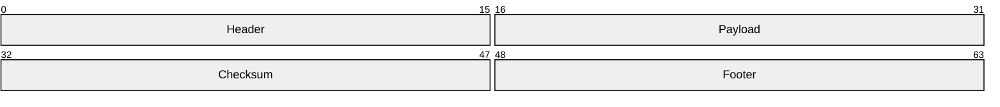
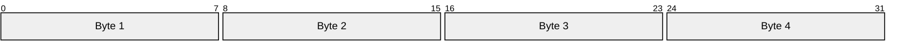
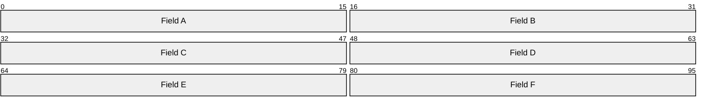
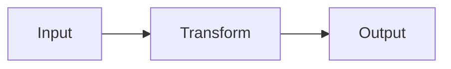
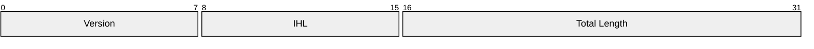

# Mermaid Configuration Test

This page tests that per-code-block configuration works correctly and doesn't leak between diagrams.

## Flowchart Tests

### Flowchart 1: Default Theme

### Flowchart 2: Forest Theme

This should use the forest theme. If config isolation works, it should NOT affect Flowchart 1 above.

## Packet Diagram Tests

### Packet 1: Default Settings

### Packet 2: Custom Row Height

This packet should have a taller row height (80px). If config isolation works, it should NOT affect Packet 1 above.

### Packet 3: Custom Bits Per Row (16-bit)

Default is 32 bits per row. This uses 16 bits per row - each row should be half the width.

### Packet 4: Custom Bits Per Row (48-bit)

This uses 48 bits per row - wider rows with more fields fitting horizontally.

## Mixed Config Test

### Flowchart with Dark Theme

### Packet with Multiple Options

## Verification Checklist

After the page loads, verify:

1. **Flowchart 1** uses the default theme (matches your site's light/dark mode)
2. **Flowchart 2** uses the green "forest" theme
3. **Packet 1** has default row heights
4. **Packet 2** has noticeably taller rows (80px)
5. **Dark flowchart** has a dark background
6. **Final packet** has neutral theme with custom dimensions

If any diagram's config affects another diagram, the isolation is broken.
