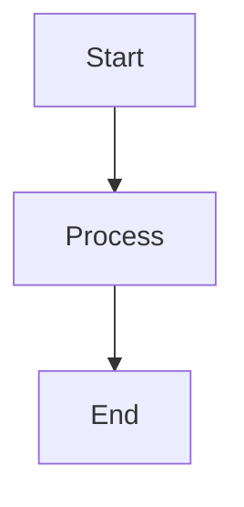
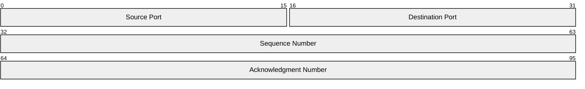
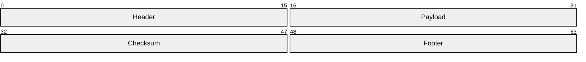
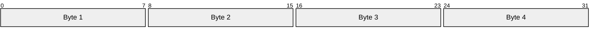
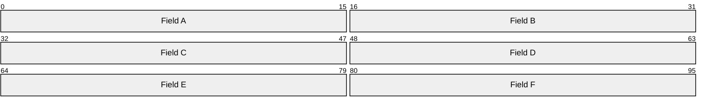
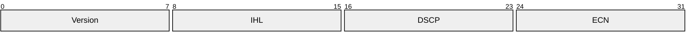

# Mermaid Configuration Test

This page tests that per-code-block configuration works correctly and doesn't leak between diagrams.

## Flowchart Examples

### Basic Flowchart

````md

````


## Packet Diagram Examples

### Packet 1: Default Settings

````md

````


### Packet 2: Custom Row Height

Uses `rowHeight="80"` for taller rows.

````md

````


### Packet 3: 16 Bits Per Row

Uses `bitsPerRow="16"` - narrower diagram with fewer columns per row.

````md

````


### Packet 4: 48 Bits Per Row

Uses `bitsPerRow="48"` - wider diagram with more columns per row.

````md

````


### Packet 5: Combined Options

Uses both `rowHeight="60"` and `bitsPerRow="16"` together.

````md

````


## Configuration Isolation Test

The diagrams above should each have their own independent configuration. If Packet 1 (default) looks the same width as Packet 3 (16-bit), the configuration is leaking between diagrams.
